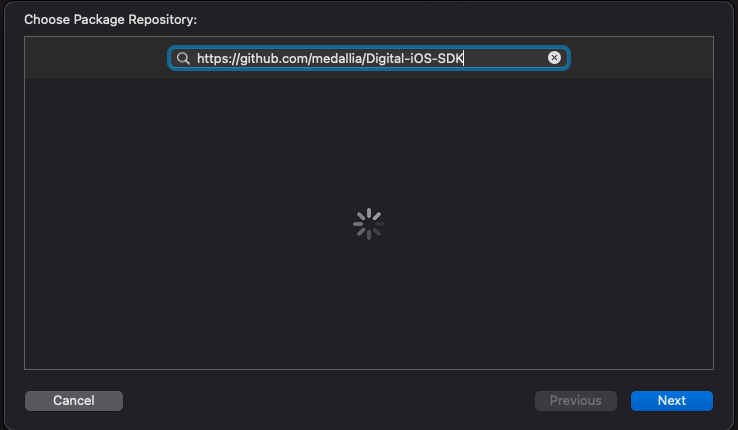
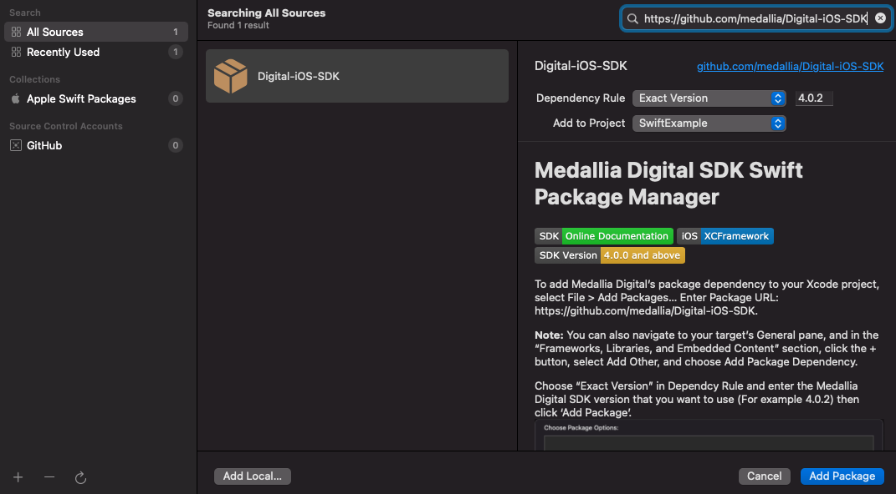
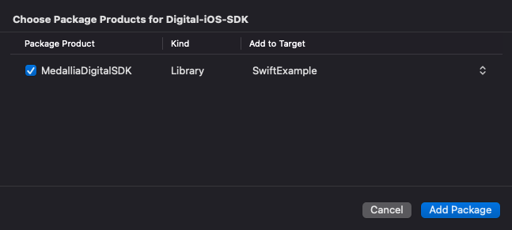

# Medallia Digital SDK Swift Package Manager

To add Medallia Digital's package dependency to your Xcode project, select File > Swift Packages > Add Package Dependency and enter https://github.com/medallia/Digital-iOS-SDK and click 'Next'.

**Note:** You can also navigate to your target’s General pane, and in the “Frameworks, Libraries, and Embedded Content” section, click the + button, select Add Other, and choose Add Package Dependency.

Enter the Medallia Digital SDK version that you want to use (For example 3.9.0) and click 'Next'.

Add the package by cliking on 'Finish'.

